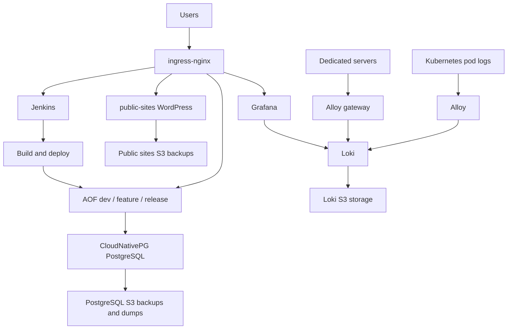

# AOF Infrastructure

This repository contains infrastructure for the AOF Kubernetes platform, CI/CD, databases, backups, public WordPress sites, and observability.

The active production-like environment is the Selectel Kubernetes cluster in `k8s/selectel`. Local `kind` still exists for development and component testing.

## Repository Map

```text
.
|-- cloud/
|   `-- selectel/          # Selectel cloud resources outside Kubernetes
|-- k8s/
|   |-- README.md          # Kubernetes overview and resource model
|   |-- OPERATIONS.md      # kubectl/debug/logs/runbook commands
|   |-- kind/              # Local kind cluster
|   `-- selectel/          # Selectel Kubernetes OpenTofu root
|-- modules/               # Reusable OpenTofu modules
|-- ops/
|   `-- dedicated-servers/ # Non-Kubernetes host configs and runbooks
`-- jenkins/               # Jenkins-related files and pipeline history
```

Start here:

- [Kubernetes overview](./k8s/README.md)
- [Kubernetes operations guide](./k8s/OPERATIONS.md)
- [Selectel Kubernetes docs](./k8s/selectel/README.md)
- [Local kind docs](./k8s/kind/README.md)
- [Dedicated server Alloy configs](./ops/dedicated-servers/alloy/README.md)

## Current Setup

The Selectel cluster currently runs:

- `aof-dev`, `aof-feature`, `aof-release` application namespaces.
- Redis, Ignite, RabbitMQ, PostgreSQL, and frontend gateway per AOF namespace.
- CloudNativePG PostgreSQL with physical backups, WAL archive, and logical dump CronJobs.
- Jenkins for frontend builds, backend image builds, deployments, and manual DB dump/restore jobs.
- `public-sites` namespace with WordPress sites for `l.zazer.mobi`, `hitmakers.games`, and `hitmakers.website`.
- S3 backups for public sites.
- `observability` namespace with Grafana, Loki, Alloy, and a dedicated-server log push gateway.
- ingress-nginx and cert-manager for public HTTPS access.

High-level flow:



## Main Commands

Selectel Kubernetes:

```powershell
cd k8s/selectel
tofu init -backend-config=secret.backend.tfvars
tofu plan
tofu apply
```

Cluster inspection:

```powershell
kubectl get nodes -o wide
kubectl get pods -A
kubectl get ingress -A
kubectl get certificate -A
```

Useful outputs:

```powershell
cd k8s/selectel
tofu output
tofu output -raw grafana_admin_password
tofu output -raw jenkins_admin_password
tofu output -raw dedicated_logs_basic_auth_password
```

Do not paste sensitive outputs into shared chats or tickets.

## Important Namespaces

| Namespace | Purpose |
| --- | --- |
| `aof-dev` | Dev AOF stand |
| `aof-feature` | Feature AOF stand |
| `aof-release` | Release AOF stand |
| `public-sites` | Legacy public WordPress sites |
| `observability` | Grafana, Loki, Alloy |
| `jenkins` | CI/CD |
| `ingress-nginx` | Public ingress controller |
| `cert-manager` | TLS certificate automation |
| `cnpg-system` | CloudNativePG operator |

## Public Hosts

Current important hosts:

- `dev.k8s.zazer.fun`
- `feature.k8s.zazer.fun`
- `release.k8s.zazer.fun`
- `grafana.k8s.zazer.fun`
- Jenkins host from `k8s/selectel` variables
- `l.zazer.mobi`
- `hitmakers.games`
- `hitmakers.website`

## Backups

PostgreSQL has two backup forms:

- physical CloudNativePG backups and WAL archive for cluster recovery;
- logical `pg_dump -Fc` dumps for manual restore/debug workflows.

Public WordPress sites have daily S3 backups at `03:00 Europe/Moscow`.

Loki stores logs in S3 and Grafana reads them through the Loki datasource.

See:

- [PostgreSQL operations](./k8s/OPERATIONS.md#postgresql)
- [PostgreSQL backups](./k8s/OPERATIONS.md#postgresql-backups)
- [Public sites operations](./k8s/OPERATIONS.md#public-sites)
- [Selectel backup details](./k8s/selectel/README.md#postgresql-backups)

## Observability

Grafana is available at:

```text
https://grafana.k8s.zazer.fun
```

Kubernetes pod logs are collected by Alloy DaemonSet. Dedicated servers push logs to:

```text
https://grafana.k8s.zazer.fun/loki/api/v1/push
```

Credentials for dedicated Alloy agents:

```powershell
cd k8s/selectel
tofu output -raw dedicated_logs_basic_auth_username
tofu output -raw dedicated_logs_basic_auth_password
```

Useful Grafana LogQL examples:

```logql
{namespace="aof-feature"}
{namespace="aof-release", app="aof-back"}
{source="dedicated", host="kayra", env="feature"}
{source="dedicated", env="prod"}
{namespace=~"aof-dev|aof-feature|aof-release"} |~ "(?i)(error|exception|failed|fatal|timeout)"
```

See [observability operations](./k8s/OPERATIONS.md#observability).

Dedicated server Alloy configs and install notes are stored in [ops/dedicated-servers/alloy](./ops/dedicated-servers/alloy/README.md).

## Local Kind

The local kind setup is still useful for testing cluster internals without touching Selectel.

It can run:

- ingress-nginx;
- cert-manager;
- Jenkins;
- local S3-compatible MinIO;
- local frontend gateway;
- CloudNativePG;
- backend chart experiments.

See [k8s/kind/README.md](./k8s/kind/README.md).

## Working Rules

- Treat OpenTofu as the source of truth for long-lived resources.
- Prefer `tofu plan` before changes and review destroys carefully.
- Manual `kubectl patch/edit/delete` can create drift; use it only for incident response or short-lived debugging.
- Never commit state files, kubeconfigs, credentials, or generated secrets.
- Keep Selectel-specific cloud resources under `cloud/selectel`.
- Keep Kubernetes cluster composition under `k8s/selectel`.
- Keep reusable logic in `modules`.
