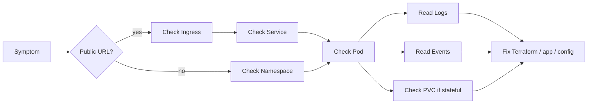
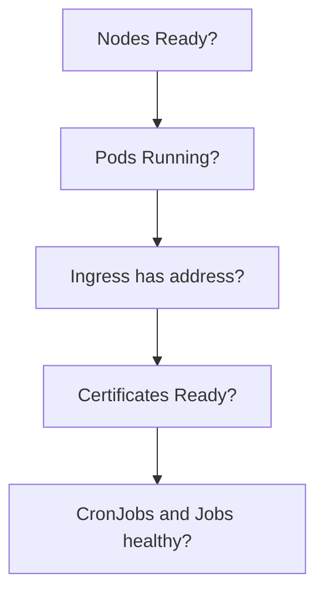
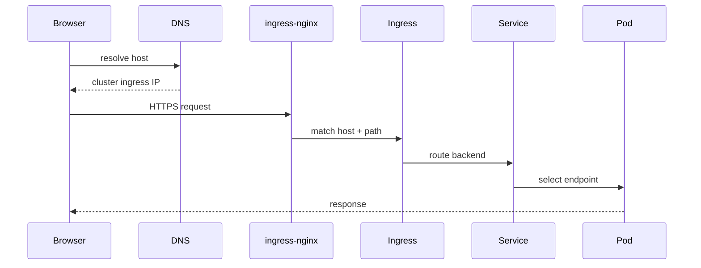
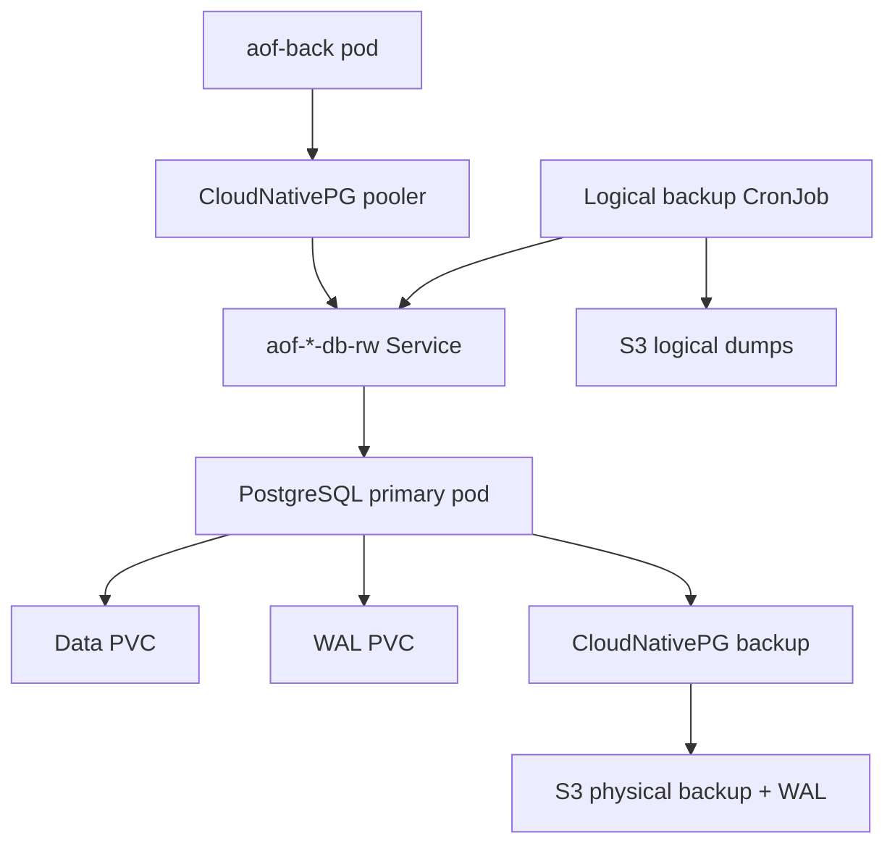
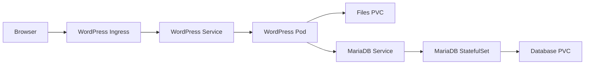
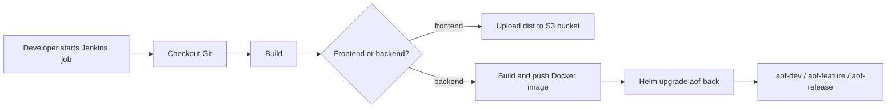

# Kubernetes Operations

This file is a practical command guide for reading cluster state, debugging failures, checking logs, and triggering routine jobs.

## How To Think During Debugging

Most Kubernetes debugging follows the same path:



For public HTTP issues, debug from outside to inside:

```text
DNS -> ingress-nginx -> Ingress -> Service -> Pod -> application logs
```

For internal service issues, debug from the caller to the dependency:

```text
caller pod -> service DNS -> service endpoints -> target pod -> target logs
```

Use the right kube context before running commands:

```powershell
kubectl config current-context
kubectl config get-contexts
```

## Fast Health Check

```powershell
kubectl get nodes -o wide
kubectl get pods -A
kubectl get ingress -A
kubectl get certificate -A
kubectl get cronjob -A
```

Look for:

- pods not `Running` or not `Completed`;
- high restart counts;
- ingresses without an address;
- certificates not `Ready`;
- CronJobs with recent failures.

Fast visual model:



## Namespaced Inspection

Replace the namespace with `aof-dev`, `aof-feature`, `aof-release`, `public-sites`, `observability`, or `jenkins`.

```powershell
kubectl -n aof-feature get pods,svc,ingress,pvc
kubectl -n aof-feature get events --sort-by=.lastTimestamp
kubectl -n aof-feature describe pod <pod>
kubectl -n aof-feature describe ingress <ingress>
```

## Logs

Deployment logs:

```powershell
kubectl -n observability logs deploy/grafana --tail=100
kubectl -n observability logs deploy/loki --tail=100
kubectl -n jenkins logs statefulset/jenkins --tail=100
```

Follow logs:

```powershell
kubectl -n observability logs deploy/grafana -f
```

Previous crashed container logs:

```powershell
kubectl -n aof-feature logs <pod> --previous
```

Specific container in a multi-container pod:

```powershell
kubectl -n aof-feature logs <pod> -c <container> --tail=100
```

## Pod Debugging

Open a shell in a pod:

```powershell
kubectl -n aof-feature exec -it <pod> -- sh
```

Check service DNS from a temporary pod:

```powershell
kubectl -n aof-feature run dns-test --rm -it --image=busybox:1.36 --restart=Never -- nslookup redis.aof-feature.svc.cluster.local
```

Check HTTP from inside the cluster:

```powershell
kubectl -n aof-feature run curl-test --rm -it --image=curlimages/curl:8.8.0 --restart=Never -- curl -I http://frontend-gateway:8080/nginx-health
```

## Ingress And TLS

Ingress resources route public traffic to Services through ingress-nginx.



```powershell
kubectl get ingress -A
kubectl -n ingress-nginx get pods,svc
kubectl -n ingress-nginx logs deploy/ingress-nginx-controller --tail=100
```

Certificates are issued by cert-manager.

```powershell
kubectl get certificate,certificaterequest,order,challenge -A
kubectl -n public-sites describe certificate hitmakers-tls
kubectl -n cert-manager logs deploy/cert-manager --tail=100
```

External test without changing local DNS:

```powershell
curl.exe -I https://grafana.k8s.zazer.fun
curl.exe -I https://hitmakers.games
```

## PostgreSQL

PostgreSQL is managed by CloudNativePG. Each AOF namespace has one cluster:

- `aof-dev-db`
- `aof-feature-db`
- `aof-release-db`

Inspect:

```powershell
kubectl -n aof-feature get cluster,backup,scheduledbackup,pooler,pod,pvc
kubectl -n aof-feature describe cluster aof-feature-db
kubectl -n aof-feature logs cluster/aof-feature-db --tail=100
```

Connection endpoints inside the cluster:

```text
aof-feature-db-rw.aof-feature.svc.cluster.local:5432
aof-feature-db-ro.aof-feature.svc.cluster.local:5432
```

App credentials are stored in:

```powershell
kubectl -n aof-feature get secret aof-feature-db-app
```

Do not print secrets into shared chat unless required for an incident.

PostgreSQL resource map:



## PostgreSQL Backups

There are two backup types:

- physical CloudNativePG backups and WAL archive, used for cluster-level recovery;
- logical `pg_dump -Fc` dumps, used for manual restore/debug workflows.

Check scheduled logical backup jobs:

```powershell
kubectl -n aof-feature get cronjob
kubectl -n aof-feature get jobs --sort-by=.metadata.creationTimestamp
```

Trigger a logical backup manually:

```powershell
kubectl -n aof-feature create job --from=cronjob/feature-postgres-logical-backup-to-s3 feature-postgres-logical-backup-manual-$(Get-Date -Format yyyyMMddHHmmss)
```

Watch the job:

```powershell
kubectl -n aof-feature get pods -l app.kubernetes.io/component=logical-backup
kubectl -n aof-feature logs job/<job-name> --all-containers=true
```

## Public Sites

Namespace:

```powershell
kubectl -n public-sites get pods,svc,ingress,pvc,cronjob
```

Expected sites:

- `l.zazer.mobi` -> `l-zazer-wordpress`
- `hitmakers.games`, `hitmakers.website` -> `hitmakers-wordpress`

Public site request flow:



Check WordPress and MariaDB:

```powershell
kubectl -n public-sites logs deploy/l-zazer-wordpress --tail=100
kubectl -n public-sites logs statefulset/l-zazer-db --tail=100
kubectl -n public-sites logs deploy/hitmakers-wordpress --tail=100
kubectl -n public-sites logs statefulset/hitmakers-db --tail=100
```

Trigger public-site backup:

```powershell
kubectl -n public-sites create job --from=cronjob/l-zazer-backup-to-s3 l-zazer-backup-manual-$(Get-Date -Format yyyyMMddHHmmss)
kubectl -n public-sites create job --from=cronjob/hitmakers-backup-to-s3 hitmakers-backup-manual-$(Get-Date -Format yyyyMMddHHmmss)
```

Trigger public-site restore from the configured S3 backup path:

```powershell
kubectl -n public-sites create job --from=cronjob/l-zazer-restore-from-s3 l-zazer-restore-manual-$(Get-Date -Format yyyyMMddHHmmss)
kubectl -n public-sites create job --from=cronjob/hitmakers-restore-from-s3 hitmakers-restore-manual-$(Get-Date -Format yyyyMMddHHmmss)
```

Restores overwrite files and database. Confirm the configured backup path in OpenTofu before running restore jobs.

## Observability

Namespace:

```powershell
kubectl -n observability get pods,svc,ingress,pvc
```

Components:

- Grafana UI and dashboards.
- Loki log storage.
- Alloy DaemonSet for Kubernetes pod logs.
- Alloy gateway Deployment for dedicated server log pushes.

Log collection flow:

```mermaid
flowchart TB
  subgraph k8s[Kubernetes cluster]
    pods[AOF / public-sites / platform pods] --> files[/var/log/pods on nodes]
    files --> alloy[Alloy DaemonSet]
    gateway[Alloy gateway]
    alloy --> loki[Loki]
    gateway --> loki
    grafana[Grafana] --> loki
  end

  subgraph dedicated[Dedicated servers]
    prod[Production Alloy] --> gateway
    kayra[Kayra Alloy] --> gateway
  end

  loki --> s3[Selectel S3]
```

Check logs:

```powershell
kubectl -n observability logs deploy/grafana --tail=100
kubectl -n observability logs deploy/loki --tail=100
kubectl -n observability logs daemonset/alloy --tail=100
kubectl -n observability logs deploy/alloy-gateway --tail=100
```

Useful LogQL queries in Grafana:

```logql
{namespace="aof-feature"}
{namespace="aof-release", app="aof-back"}
{source="dedicated", host="kayra", env="feature"}
{source="dedicated", env="prod"}
{namespace=~"aof-dev|aof-feature|aof-release"} |~ "(?i)(error|exception|failed|fatal|timeout)"
```

Dedicated server Alloy agents push to:

```text
https://grafana.k8s.zazer.fun/loki/api/v1/push
```

Basic auth credentials are exposed by OpenTofu outputs in `k8s/selectel`.

## Jenkins

Namespace:

```powershell
kubectl -n jenkins get pods,svc,ingress,pvc
kubectl -n jenkins logs statefulset/jenkins --tail=100
```

Get admin password:

```powershell
cd k8s/selectel
tofu output -raw jenkins_admin_password
```

Main jobs:

- `aof-front` - build frontend and upload to S3.
- `aof-back` - build backend image and deploy to selected namespace.
- `aof-db-dump` - manual logical PostgreSQL dump to S3.
- `aof-db-restore` - restore logical PostgreSQL dump into selected namespace.

Deployment flow:



## Resource Pressure

Check pod requests, limits, and actual usage:

```powershell
kubectl top nodes
kubectl top pods -A
kubectl -n aof-feature describe pod <pod>
```

If `kubectl top` does not work, metrics-server is missing or unavailable.

Common scheduling errors:

- insufficient CPU or memory;
- PVC cannot bind;
- node affinity or taint mismatch;
- image pull credentials are wrong;
- storage class does not exist in the target cluster.

## OpenTofu Safety

Always review before apply:

```powershell
cd k8s/selectel
tofu plan
```

If the plan wants to destroy a persistent resource, stop and understand why.

Especially sensitive resources:

- PVCs;
- PostgreSQL clusters;
- S3 buckets;
- Secrets used by databases and backups;
- Grafana and Jenkins PVCs.
