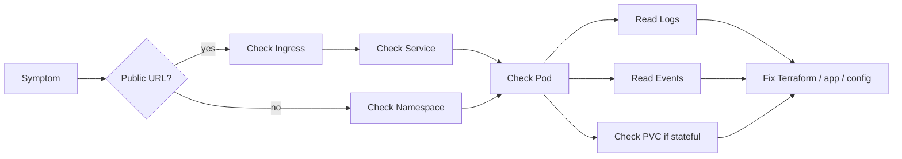
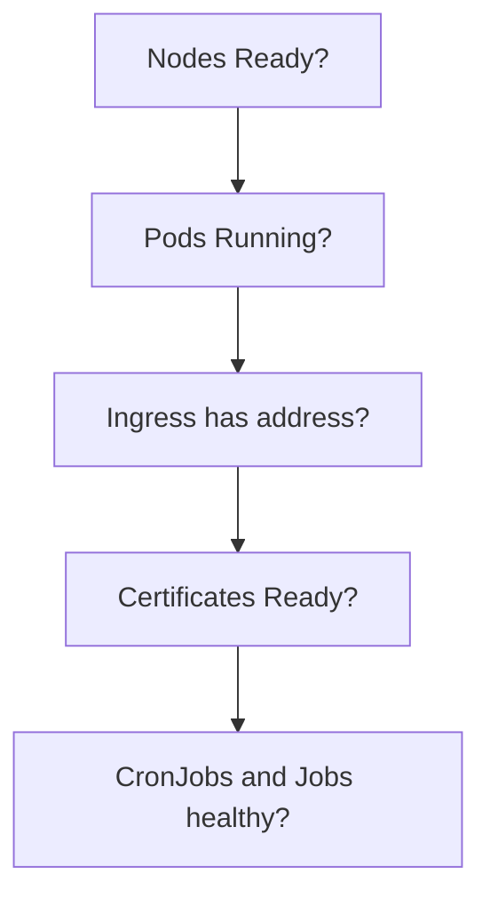
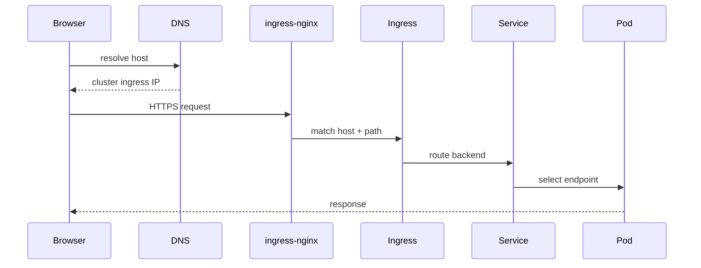
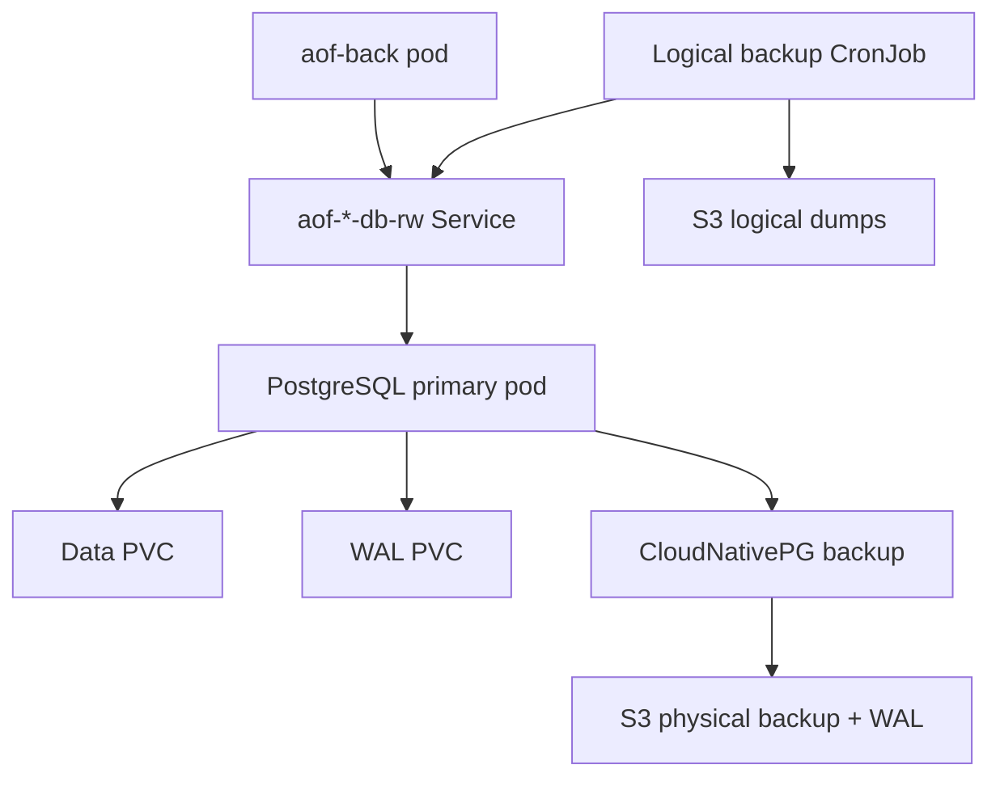
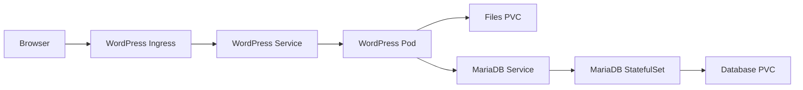
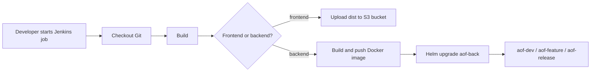

# Kubernetes Operations

This file is a practical command guide for reading cluster state, debugging failures, checking logs, and triggering routine jobs.

## How To Think During Debugging

Most Kubernetes debugging follows the same path:


```mermaid
flowchart LR
  symptom[Symptom] --> ingress{Public URL?}
  ingress -- yes --> ing[Check Ingress]
  ing --> svc[Check Service]
  svc --> pod[Check Pod]
  pod --> logs[Read Logs]
  pod --> events[Read Events]
  pod --> pvc[Check PVC if stateful]

  ingress -- no --> ns[Check Namespace]
  ns --> pod

  logs --> fix[Fix Terraform / app / config]
  events --> fix
  pvc --> fix
```

For public HTTP issues, debug from outside to inside:

```text
DNS -> ingress-nginx -> Ingress -> Service -> Pod -> application logs
```

For internal service issues, debug from the caller to the dependency:

```text
caller pod -> service DNS -> service endpoints -> target pod -> target logs
```

Use the right kube context before running commands:

```powershell
kubectl config current-context
kubectl config get-contexts
```

## Fast Health Check

```powershell
kubectl get nodes -o wide
kubectl get pods -A
kubectl get ingress -A
kubectl get certificate -A
kubectl get cronjob -A
```

Look for:

- pods not `Running` or not `Completed`;
- high restart counts;
- ingresses without an address;
- certificates not `Ready`;
- CronJobs with recent failures.

Fast visual model:


```mermaid
flowchart TB
  nodes[Nodes Ready?]
  pods[Pods Running?]
  ingress[Ingress has address?]
  certs[Certificates Ready?]
  jobs[CronJobs and Jobs healthy?]
  nodes --> pods --> ingress --> certs --> jobs
```

## Namespaced Inspection

Replace the namespace with `aof-dev`, `aof-feature`, `aof-release`, `public-sites`, `observability`, or `jenkins`.

```powershell
kubectl -n aof-feature get pods,svc,ingress,pvc
kubectl -n aof-feature get events --sort-by=.lastTimestamp
kubectl -n aof-feature describe pod <pod>
kubectl -n aof-feature describe ingress <ingress>
```

## Logs

Deployment logs:

```powershell
kubectl -n observability logs deploy/grafana --tail=100
kubectl -n observability logs deploy/loki --tail=100
kubectl -n jenkins logs statefulset/jenkins --tail=100
```

Follow logs:

```powershell
kubectl -n observability logs deploy/grafana -f
```

Previous crashed container logs:

```powershell
kubectl -n aof-feature logs <pod> --previous
```

Specific container in a multi-container pod:

```powershell
kubectl -n aof-feature logs <pod> -c <container> --tail=100
```

## Pod Debugging

Open a shell in a pod:

```powershell
kubectl -n aof-feature exec -it <pod> -- sh
```

Check service DNS from a temporary pod:

```powershell
kubectl -n aof-feature run dns-test --rm -it --image=busybox:1.36 --restart=Never -- nslookup aof-feature-db-rw.aof-feature.svc.cluster.local
```

Check HTTP from inside the cluster:

```powershell
kubectl -n aof-feature run curl-test --rm -it --image=curlimages/curl:8.8.0 --restart=Never -- curl -I http://frontend-gateway:8080/nginx-health
```

## Ingress And TLS

Ingress resources route public traffic to Services through ingress-nginx.


```mermaid
sequenceDiagram
  participant Browser
  participant DNS
  participant Nginx as ingress-nginx
  participant Ingress
  participant Service
  participant Pod

  Browser->>DNS: resolve host
  DNS-->>Browser: cluster ingress IP
  Browser->>Nginx: HTTPS request
  Nginx->>Ingress: match host + path
  Ingress->>Service: route backend
  Service->>Pod: select endpoint
  Pod-->>Browser: response
```

```powershell
kubectl get ingress -A
kubectl -n ingress-nginx get pods,svc
kubectl -n ingress-nginx logs deploy/ingress-nginx-controller --tail=100
```

Certificates are issued by cert-manager.

```powershell
kubectl get certificate,certificaterequest,order,challenge -A
kubectl -n public-sites describe certificate hitmakers-tls
kubectl -n cert-manager logs deploy/cert-manager --tail=100
```

External test without changing local DNS:

```powershell
curl.exe -I https://grafana.k8s.zazer.fun
curl.exe -I https://hitmakers.games
```

## PostgreSQL

PostgreSQL is managed by CloudNativePG. Each AOF namespace has one cluster:

- `aof-dev-db`
- `aof-feature-db`
- `aof-release-db`

Inspect:

```powershell
kubectl -n aof-feature get cluster,backup,scheduledbackup,pod,pvc
kubectl -n aof-feature describe cluster aof-feature-db
kubectl -n aof-feature logs cluster/aof-feature-db --tail=100
```

Connection endpoints inside the cluster:

```text
aof-feature-db-rw.aof-feature.svc.cluster.local:5432
aof-feature-db-ro.aof-feature.svc.cluster.local:5432
```

App credentials are stored in:

```powershell
kubectl -n aof-feature get secret aof-feature-db-app
```

Do not print secrets into shared chat unless required for an incident.

PostgreSQL resource map:


```mermaid
flowchart TB
  app[aof-back pod] --> rw[aof-*-db-rw Service]
  rw --> primary[PostgreSQL primary pod]
  primary --> dataPVC[Data PVC]
  primary --> walPVC[WAL PVC]
  primary --> barman[CloudNativePG backup]
  barman --> s3[S3 physical backup + WAL]
  cron[Logical backup CronJob] --> rw
  cron --> dumpS3[S3 logical dumps]
```

## PostgreSQL Backups

There are two backup types:

- physical CloudNativePG backups and WAL archive, used for cluster-level recovery;
- logical `pg_dump -Fc` dumps, used for manual restore/debug workflows.

Check scheduled logical backup jobs:

```powershell
kubectl -n aof-feature get cronjob
kubectl -n aof-feature get jobs --sort-by=.metadata.creationTimestamp
```

Trigger a logical backup manually:

```powershell
kubectl -n aof-feature create job --from=cronjob/feature-postgres-logical-backup-to-s3 feature-postgres-logical-backup-manual-$(Get-Date -Format yyyyMMddHHmmss)
```

Watch the job:

```powershell
kubectl -n aof-feature get pods -l app.kubernetes.io/component=logical-backup
kubectl -n aof-feature logs job/<job-name> --all-containers=true
```

## Public Sites

Namespace:

```powershell
kubectl -n public-sites get pods,svc,ingress,pvc,cronjob
```

Expected sites:

- `l.zazer.mobi` -> `l-zazer-wordpress`
- `hitmakers.games`, `hitmakers.website` -> `hitmakers-wordpress`

Public site request flow:


```mermaid
flowchart LR
  browser[Browser] --> ingress[WordPress Ingress]
  ingress --> svc[WordPress Service]
  svc --> wp[WordPress Pod]
  wp --> files[Files PVC]
  wp --> dbSvc[MariaDB Service]
  dbSvc --> db[MariaDB StatefulSet]
  db --> dbPVC[Database PVC]
```

Check WordPress and MariaDB:

```powershell
kubectl -n public-sites logs deploy/l-zazer-wordpress --tail=100
kubectl -n public-sites logs statefulset/l-zazer-db --tail=100
kubectl -n public-sites logs deploy/hitmakers-wordpress --tail=100
kubectl -n public-sites logs statefulset/hitmakers-db --tail=100
```

Trigger public-site backup:

```powershell
kubectl -n public-sites create job --from=cronjob/l-zazer-backup-to-s3 l-zazer-backup-manual-$(Get-Date -Format yyyyMMddHHmmss)
kubectl -n public-sites create job --from=cronjob/hitmakers-backup-to-s3 hitmakers-backup-manual-$(Get-Date -Format yyyyMMddHHmmss)
```

Trigger public-site restore from the configured S3 backup path:

```powershell
kubectl -n public-sites create job --from=cronjob/l-zazer-restore-from-s3 l-zazer-restore-manual-$(Get-Date -Format yyyyMMddHHmmss)
kubectl -n public-sites create job --from=cronjob/hitmakers-restore-from-s3 hitmakers-restore-manual-$(Get-Date -Format yyyyMMddHHmmss)
```

Restores overwrite files and database. Confirm the configured backup path in OpenTofu before running restore jobs.

## Observability

Namespace:

```powershell
kubectl -n observability get pods,svc,ingress,pvc
```

Components:

- Grafana UI and dashboards.
- Loki log storage.
- Alloy DaemonSet for Kubernetes pod logs.
- Alloy gateway Deployment for dedicated server log pushes.

Log collection flow:

```mermaid
flowchart TB
  subgraph k8s[Kubernetes cluster]
    pods[AOF / public-sites / platform pods] --> files[/var/log/pods on nodes]
    files --> alloy[Alloy DaemonSet]
    gateway[Alloy gateway]
    alloy --> loki[Loki]
    gateway --> loki
    grafana[Grafana] --> loki
  end

  subgraph dedicated[Dedicated servers]
    prod[Production Alloy] --> gateway
    kayra[Kayra Alloy] --> gateway
  end

  loki --> s3[Selectel S3]
```

Check logs:

```powershell
kubectl -n observability logs deploy/grafana --tail=100
kubectl -n observability logs deploy/loki --tail=100
kubectl -n observability logs daemonset/alloy --tail=100
kubectl -n observability logs deploy/alloy-gateway --tail=100
```

Useful LogQL queries in Grafana:

```logql
{namespace="aof-feature"}
{namespace="aof-release", app="aof-back"}
{source="dedicated", host="kayra", env="feature"}
{source="dedicated", env="prod"}
{namespace=~"aof-dev|aof-feature|aof-release"} |~ "(?i)(error|exception|failed|fatal|timeout)"
```

Dedicated server Alloy agents push to:

```text
https://grafana.k8s.zazer.fun/loki/api/v1/push
```

Basic auth credentials are exposed by OpenTofu outputs in `k8s/selectel`.

## Jenkins

Namespace:

```powershell
kubectl -n jenkins get pods,svc,ingress,pvc
kubectl -n jenkins logs statefulset/jenkins --tail=100
```

Get admin password:

```powershell
cd k8s/selectel
tofu output -raw jenkins_admin_password
```

Main jobs:

- `aof-front` - manually build frontend and upload to the selected S3 bucket; existing history retained.
- `aof-front-dev` - poll `develop` every three hours and deploy to dev.
- `aof-front-feature` - manually deploy a selected branch (default `develop`) to feature.
- `aof-front-release` - poll `release` every three hours and deploy to release.
- `aof-back` - build backend image and deploy to selected namespace.
- `aof-back-dev` - poll and deploy backend `develop` to dev.
- `aof-back-feature` - manually deploy a developer-selected backend branch to feature (default `develop`).
- `aof-back-release` - poll and deploy backend `test` to release.
- `aof-db-dump` - manual logical PostgreSQL dump to S3.
- `aof-db-restore` - restore logical PostgreSQL dump into selected namespace.

Default Git branches when `GIT_BRANCH` is empty:

| INSTANCE | `aof-front` | `aof-back` |
|----------|-------------|------------|
| `dev` | `develop` | `develop` |
| `feature` | `develop` | `develop` |
| `release` | `test` | `test` |

The dev and release backend jobs use **Triggers → Poll SCM** with
`H */3 * * *`: every three hours, at a stable Jenkins-selected minute. After the
initial build establishes Git history, polling schedules builds only for new
commits. **Build periodically** is not enabled. Polling jobs are created only
for stands enabled in the module's instance list. Each job pins its stand and
branch in the pipeline; the original `aof-back` job and its history are retained.
Dev and release expose only `DEPLOY_TIMEOUT`; feature also exposes `GIT_BRANCH`. Git credentials are configured
in the pipeline, and image tags are generated from the stand, build number, and
commit. The original manual job retains its stand, branch, credentials, and image
tag overrides.

Feature has no automatic trigger and runs only when started manually.
All three stand-specific jobs disable concurrent builds. If changes arrive while it is
running, Jenkins queues a build until the active build finishes. The shared
stand lock also makes it wait for manual deployments and database restores,
before allocating an agent. This preserves pending changes without overlapping
work on the same stand. Dev, feature, and release can run independently.

Apply the Jenkins module to install the generated jobs. Each new polling job
needs an initial build to establish its checkout history (the first poll can
start it); it can also be started manually with **Build with Parameters**.
Check **Polling Log** in each job to inspect subsequent Git checks.

Backend deployments default to `DEPLOY_TIMEOUT=15m`; increase this explicitly
for known slow migrations. Jenkins caps the deploy step at that timeout plus one
minute, then allows at most two minutes for failure diagnostics. A Helm error
fails the build even if diagnostics also fail. The console includes pod status
and details, recent namespace events, and the last 200 lines of current and
previous logs from each pod's containers.

Backend pipeline code lives in `modules/jenkins/backend/pipeline.groovy.tftpl`;
build, deployment, and diagnostic scripts live alongside it. OpenTofu renders
both CI and compute agent YAML from structured objects. Scripts are mounted from
a content-addressed ConfigMap and copied into the build workspace before use.
Apply tooling updates while backend jobs are idle; retain older tooling ConfigMaps
while a queued or running build still references them.

Allocation has a 15-minute CI deadline and a 10-minute compute fallback deadline;
checkout allows 10 minutes, and image build/push allows 45 minutes. Explicit user
cancellation does not start a fallback build. The stand lock covers the entire run.
Only idempotent preflight reads and registry transfers have bounded retries; Helm
upgrade and database migrations are never automatically retried.

The console shows build milestones and rollout status every 15 seconds. The
scoped `aof-backend-console` helper condenses repeated Kubernetes plugin messages
and routine Git command echoes only for backend jobs. Raw agent YAML is disabled.
Full image-build output, Helm output, and failure diagnostics are archived under
`ci-logs/`, retained for up to 14 days / 20 builds without deleting build history.
Log and digest files are readable by the Jenkins agent across containers, while
registry authentication files remain private and are removed on exit. Cluster
access uses an explicit service-account tokenFile configuration so kubectl request
timeouts cannot accidentally switch it to localhost.
Registry authentication commands are never echoed; rendered manifests are private
temporary files and are not archived.

Deployment uses the digest produced by Kaniko, not a tag lookup. Each pod template
is marked with the job/build identity. The monitor checks the observed deployment
generation, owned ReplicaSet revision, and pod ownership before making decisions.
It fails early on CrashLoopBackOff, 3 container restarts, invalid image/configuration,
OOMKilled, failed pods, or image-pull failures persisting for 60 seconds. Slow
readiness alone retains the configured deployment deadline. Events are deduplicated
and scoped to the new pods. Helm success also requires final new-revision readiness.
Cancellation and failure terminate the Helm process group and bound diagnostics.
A pending Helm release is reported for operator review; its metadata is never deleted
or automatically unlocked.

Run script regression checks with
`python3 -m unittest discover -s modules/jenkins/tests -v` (requires Bash and jq).
The console helper's source, build instructions, and test are in
`modules/jenkins/console-filter/`.

The backend job does not use Helm's automatic rollback: failed resources remain
available for inspection. After fixing the cause, redeploy or manually roll back
to a known good revision. Apply the Jenkins module changes to update both the
generated job and its `pods/log` read permission. Builds started with an explicit
or previously saved `DEPLOY_TIMEOUT=3h` still use that value; select `15m` to use
the new default.

Deployment flow:


```mermaid
flowchart LR
  dev[Developer starts Jenkins job] --> checkout[Checkout Git]
  checkout --> build[Build]
  build --> artifact{Frontend or backend?}
  artifact -- frontend --> s3[Upload dist to S3 bucket]
  artifact -- backend --> image[Build and push Docker image]
  image --> helm[Helm upgrade aof-back]
  helm --> ns[aof-dev / aof-feature / aof-release]
```

## Resource Pressure

Check pod requests, limits, and actual usage:

```powershell
kubectl top nodes
kubectl top pods -A
kubectl -n aof-feature describe pod <pod>
```

If `kubectl top` does not work, metrics-server is missing or unavailable.

Common scheduling errors:

- insufficient CPU or memory;
- PVC cannot bind;
- node affinity or taint mismatch;
- image pull credentials are wrong;
- storage class does not exist in the target cluster.

## OpenTofu Safety

Always review before apply:

```powershell
cd k8s/selectel
tofu plan
```

If the plan wants to destroy a persistent resource, stop and understand why.

Especially sensitive resources:

- PVCs;
- PostgreSQL clusters;
- S3 buckets;
- Secrets used by databases and backups;
- Grafana and Jenkins PVCs.

Backend console pages always use a compact view without a details toggle.
Pipeline steps, branch prefixes and routine worker/checkout notices are hidden. This also applies when viewing historical builds; raw `consoleText`
and archived logs are unchanged. New builds print shorter rollout summaries on
state changes and at least every 30 seconds while waiting; health checks still
run every 15 seconds. The backend console view plugin installs dynamically on
first use without restarting Jenkins. Its source and DOM regression test are in
`modules/jenkins/console-view`.

Dedicated frontend jobs pin their stand, S3 bucket mapping, credentials, and
`npm run build` command. Feature exposes only `GIT_BRANCH`; dev and release need
no parameters. Dev and release use Poll SCM (`H */3 * * *`), which needs an initial
checkout/build to establish SCM history. All dedicated frontend jobs disable
concurrent builds and use the existing shared stand lock. The original manual
`aof-front` job retains its parameters and history.
