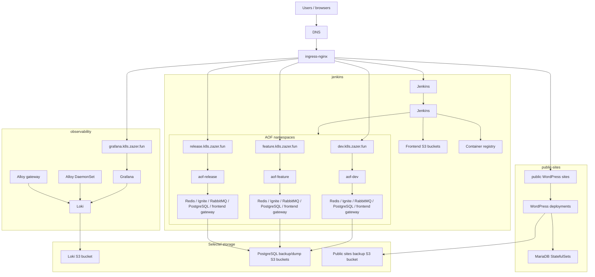
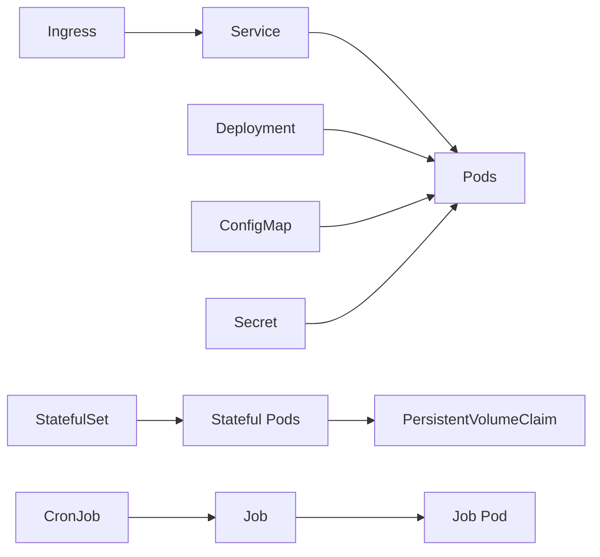
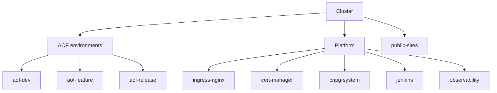
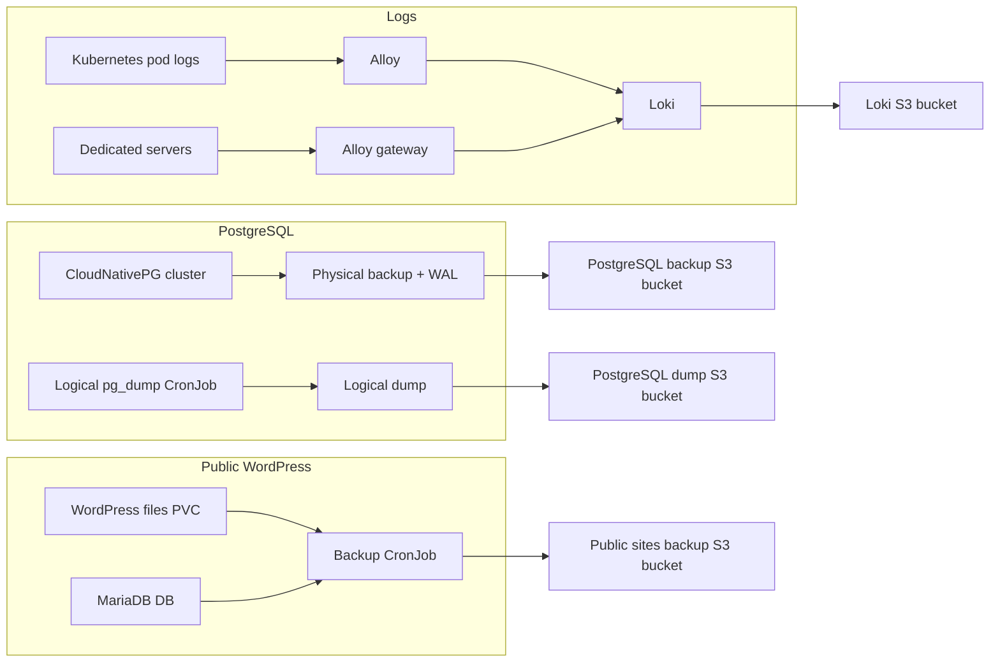

# Kubernetes Infrastructure

This folder contains Kubernetes environment entrypoints. Reusable resource definitions live in `../modules`; the folders under `k8s` compose those modules for a concrete cluster.

## Big Picture



## Folders

- `kind/` - local Kubernetes cluster for testing cluster components on a developer machine.
- `selectel/` - production-like Selectel Kubernetes cluster managed with OpenTofu.

Cloud resources that are not Kubernetes objects, such as Selectel S3 buckets, belong under `../cloud`.

## Tooling

Required day-to-day tools:

- `kubectl` - inspect and operate Kubernetes resources.
- `tofu` - apply infrastructure from this repo.
- `helm` - inspect Helm releases and test chart behavior.

Useful docs:

- Kubernetes concepts: <https://kubernetes.io/docs/concepts/>
- kubectl cheat sheet: <https://kubernetes.io/docs/reference/kubectl/cheatsheet/>
- OpenTofu CLI: <https://opentofu.org/docs/cli/>
- Helm docs: <https://helm.sh/docs/>

## Resource Model

We use these basic Kubernetes resources:

- `Namespace` - isolation boundary for one environment or platform component.
- `Deployment` - stateless pods, for example frontend gateway, Grafana, Jenkins, WordPress.
- `StatefulSet` - stateful pods with stable storage, for example MariaDB for WordPress.
- `Service` - stable in-cluster DNS and load balancing for pods.
- `Ingress` - public HTTP/HTTPS routing through ingress-nginx.
- `Secret` - credentials such as database passwords, registry credentials, and S3 keys.
- `ConfigMap` - non-secret config, scripts, and generated app configuration.
- `PersistentVolumeClaim` - disk request for stateful workloads.
- `Job` / `CronJob` - one-off and scheduled operations such as backups and restores.



Original docs:

- Workloads: <https://kubernetes.io/docs/concepts/workloads/>
- Services and networking: <https://kubernetes.io/docs/concepts/services-networking/>
- ConfigMaps: <https://kubernetes.io/docs/concepts/configuration/configmap/>
- Secrets: <https://kubernetes.io/docs/concepts/configuration/secret/>
- Persistent volumes: <https://kubernetes.io/docs/concepts/storage/persistent-volumes/>
- Jobs: <https://kubernetes.io/docs/concepts/workloads/controllers/job/>
- CronJobs: <https://kubernetes.io/docs/concepts/workloads/controllers/cron-jobs/>

## Namespaces We Use

Application stands:

- `aof-dev`
- `aof-feature`
- `aof-release`

Platform and support:

- `ingress-nginx` - public ingress controller.
- `cert-manager` - TLS certificate automation.
- `cnpg-system` - CloudNativePG operator.
- `jenkins` - CI/CD.
- `observability` - Grafana, Loki, and Alloy.
- `public-sites` - legacy public WordPress sites.



## Main Components

Application stands:

- Redis, Ignite, RabbitMQ.
- PostgreSQL through CloudNativePG.
- Frontend gateway that serves S3-hosted frontend files.
- `aof-back`, deployed by Jenkins into the selected namespace.

Public sites:

- `l-zazer` WordPress and MariaDB.
- `hitmakers` WordPress and MariaDB.
- Scheduled S3 backups and suspended restore CronJobs.

Observability:

- Grafana for UI and dashboards.
- Loki for log storage.
- Alloy DaemonSet for Kubernetes pod logs.
- Alloy gateway for logs pushed by dedicated servers.

CI/CD:

- Jenkins builds frontend, uploads frontend assets to S3, builds backend images, and deploys backend Helm chart.

## Data And Backup Paths



## Management Boundary

Most long-lived Kubernetes resources are managed by OpenTofu from this repo. Avoid editing managed objects manually unless you are debugging an incident and understand the drift it creates.

Good examples of safe read-only operations:

```powershell
kubectl get pods -A
kubectl -n aof-feature describe pod <pod>
kubectl -n observability logs deploy/grafana --tail=100
```

Examples that create Terraform drift:

```powershell
kubectl patch ingress ...
kubectl edit deployment ...
kubectl delete secret ...
```

If a manual change was needed during an incident, port it back to OpenTofu after the incident.

## Common Workflow

Inspect the current cluster:

```powershell
kubectl config current-context
kubectl get nodes -o wide
kubectl get namespaces
kubectl get ingress -A
```

Review infrastructure changes:

```powershell
cd k8s/selectel
tofu plan
```

Apply reviewed changes:

```powershell
cd k8s/selectel
tofu apply
```

Read generated outputs:

```powershell
cd k8s/selectel
tofu output
tofu output -raw grafana_admin_password
```

Use [OPERATIONS.md](./OPERATIONS.md) for debugging commands.
