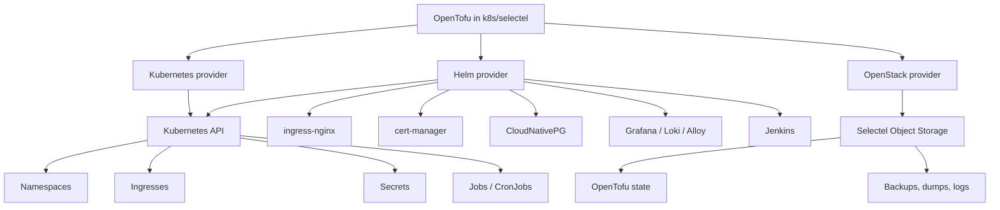
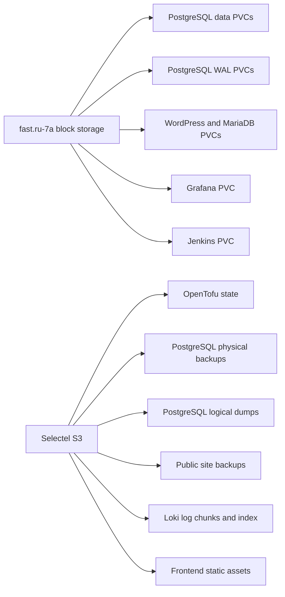
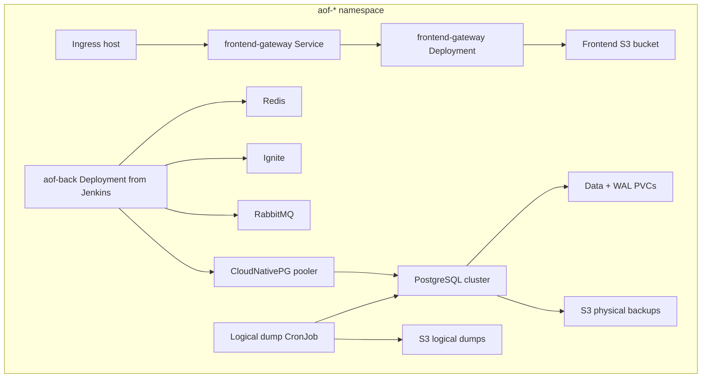
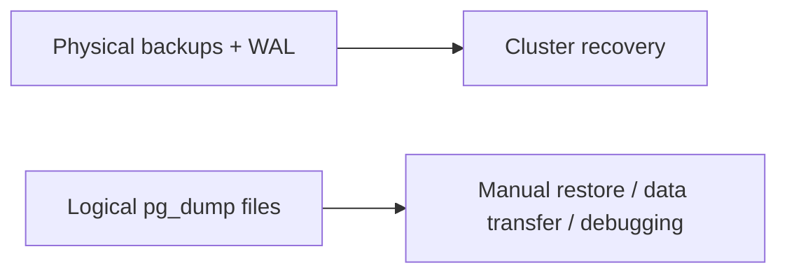
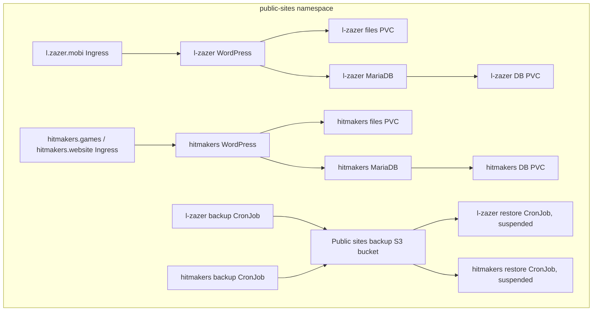

# Selectel Kubernetes

This folder composes the production-like Kubernetes cluster that runs in Selectel.

It uses:

- Kubernetes provider for native Kubernetes objects.
- Helm provider for third-party charts.
- OpenStack provider for Selectel Object Storage buckets.
- S3 backend for OpenTofu state.

## Architecture



## Entry Point

Main files:

- `main.tf` - providers, modules, namespaces, ingresses, and cluster composition.
- `variables.tf` - required configuration.
- `outputs.tf` - generated endpoints and credentials.
- `terraform.tfvars.example` - non-secret example values.
- `secret.backend.tfvars.example` - backend credentials example.

Initialize:

```powershell
cd k8s/selectel
tofu init -backend-config=secret.backend.tfvars
```

Plan:

```powershell
tofu plan
```

Apply:

```powershell
tofu apply
```

## Selectel-Specific Details

Region:

```text
ru-7
```

S3 endpoint:

```text
https://s3.ru-7.storage.selcloud.ru
```

Storage class used by stateful workloads:

```text
fast.ru-7a
```

Storage usage:



OpenTofu state is stored in Selectel S3 with path-style addressing and validation skips required for S3-compatible storage.

Provider docs:

- Selectel Object Storage S3 API: <https://docs.selectel.ru/cloud/object-storage/>
- OpenStack Terraform provider: <https://registry.terraform.io/providers/terraform-provider-openstack/openstack/latest/docs>
- Kubernetes provider: <https://registry.terraform.io/providers/hashicorp/kubernetes/latest/docs>
- Helm provider: <https://registry.terraform.io/providers/hashicorp/helm/latest/docs>

## Cluster Add-ons

The following platform modules are installed:

- `ingress-nginx` - public HTTP/HTTPS traffic.
- `cert-manager` - TLS certificates.
- `cloudnative-pg-operator` - PostgreSQL operator.
- `jenkins` - CI/CD jobs.
- `observability` - Grafana, Loki, Alloy.

Check platform namespaces:

```powershell
kubectl get ns ingress-nginx,cert-manager,cnpg-system,jenkins,observability
kubectl -n ingress-nginx get pods,svc
kubectl -n cert-manager get pods
kubectl -n cnpg-system get pods
```

## AOF Environments

The cluster has three application environments:

| Environment | Namespace | Public host | PostgreSQL cluster |
| --- | --- | --- | --- |
| dev | `aof-dev` | `dev.k8s.zazer.fun` | `aof-dev-db` |
| feature | `aof-feature` | `feature.k8s.zazer.fun` | `aof-feature-db` |
| release | `aof-release` | `release.k8s.zazer.fun` | `aof-release-db` |

Each namespace includes:

- Redis;
- Ignite;
- RabbitMQ;
- PostgreSQL with CloudNativePG;
- frontend gateway;
- registry pull secret for backend images;
- ingress for the frontend host.

Environment internals:



Inspect one environment:

```powershell
kubectl -n aof-feature get pods,svc,ingress,pvc,secret
kubectl -n aof-feature get cluster,backup,scheduledbackup,pooler
```

## PostgreSQL Backups

Each PostgreSQL cluster has:

- physical backups and WAL archive through CloudNativePG;
- logical `pg_dump -Fc` backups through a Kubernetes CronJob.

The physical backup bucket is exposed by:

```powershell
tofu output postgres_backup_bucket
```

The logical dump bucket is exposed by:

```powershell
tofu output postgres_dump_bucket
```

Automatic logical dumps use paths like:

```text
dev/automatic/
feature/automatic/
release/automatic/
```

Manual dumps use paths like:

```text
dev/manual/
feature/manual/
release/manual/
```

Backup purpose:



## Public Sites

Namespace:

```text
public-sites
```

Sites:

| Module key | Hosts | Purpose |
| --- | --- | --- |
| `l-zazer` | `l.zazer.mobi` | landing WordPress site |
| `hitmakers` | `hitmakers.games`, `hitmakers.website` | official public site |

Resources per site:

- MariaDB StatefulSet and PVC;
- WordPress Deployment and files PVC;
- Service for MariaDB;
- Service for WordPress;
- Ingress with cert-manager TLS;
- daily backup CronJob at `03:00 Europe/Moscow`;
- suspended restore CronJob for manual restore from S3.

Public sites map:



Public site backup bucket:

```powershell
tofu output public_sites_backup_s3_bucket
```

Backup prefixes:

```text
l-zazer-mobi/
hitmakers-copy/
```

## Observability

Namespace:

```text
observability
```

Public URL:

```text
https://grafana.k8s.zazer.fun
```

Get Grafana admin credentials:

```powershell
tofu output -raw grafana_admin_username
tofu output -raw grafana_admin_password
```

Loki stores log chunks and indexes in Selectel S3. Grafana stores its own UI state on a `fast.ru-7a` PVC.

Kubernetes pod logs are collected by the Alloy DaemonSet from selected namespaces.

Dedicated servers push logs through:

```text
https://grafana.k8s.zazer.fun/loki/api/v1/push
```

Get dedicated-server credentials:

```powershell
tofu output -raw dedicated_logs_basic_auth_username
tofu output -raw dedicated_logs_basic_auth_password
```

Observability request and ingest flow:

```mermaid
flowchart TB
  browser[Browser] --> grafanaIngress[grafana.k8s.zazer.fun Ingress]
  grafanaIngress --> grafana[Grafana Service]
  grafana --> loki[Loki Service]

  podLogs[Kubernetes pod logs] --> alloy[Alloy DaemonSet]
  alloy --> loki

  dedicated[Dedicated server Alloy] --> pushIngress[/loki/api/v1/push Ingress]
  pushIngress --> auth[nginx basic auth]
  auth --> gateway[Alloy gateway]
  gateway --> loki

  loki --> s3[Loki S3 bucket]
```

## Public Ingresses

Important public hosts:

- `dev.k8s.zazer.fun`
- `feature.k8s.zazer.fun`
- `release.k8s.zazer.fun`
- `grafana.k8s.zazer.fun`
- Jenkins host from `var.jenkins_host`
- `l.zazer.mobi`
- `hitmakers.games`
- `hitmakers.website`

Inspect:

```powershell
kubectl get ingress -A
kubectl get certificate -A
```

## Outputs

Common outputs:

```powershell
tofu output
tofu output aof_back_hosts
tofu output public_sites_ingresses
tofu output dedicated_logs_push_url
```

Sensitive outputs:

```powershell
tofu output -raw jenkins_admin_password
tofu output -raw grafana_admin_password
tofu output -raw dedicated_logs_basic_auth_password
```

Do not paste sensitive output into tickets or shared chats.

## Troubleshooting Selectel Issues

PVC pending:

```powershell
kubectl get storageclass
kubectl -n <namespace> describe pvc <pvc>
```

Ingress has no external address:

```powershell
kubectl -n ingress-nginx get svc
kubectl -n ingress-nginx describe svc ingress-nginx-controller
```

Certificate not ready:

```powershell
kubectl get certificate,certificaterequest,order,challenge -A
kubectl -n cert-manager logs deploy/cert-manager --tail=100
```

Object storage errors:

- verify endpoint is `https://s3.ru-7.storage.selcloud.ru`;
- verify region is `ru-7`;
- use path-style mode with S3-compatible clients;
- check access key and secret key from the intended Selectel project.

Helm repository cache errors on Windows:

```powershell
helm repo add grafana https://grafana.github.io/helm-charts
helm repo add ingress-nginx https://kubernetes.github.io/ingress-nginx
helm repo add jetstack https://charts.jetstack.io
helm repo update
```

Then rerun:

```powershell
tofu plan
```
